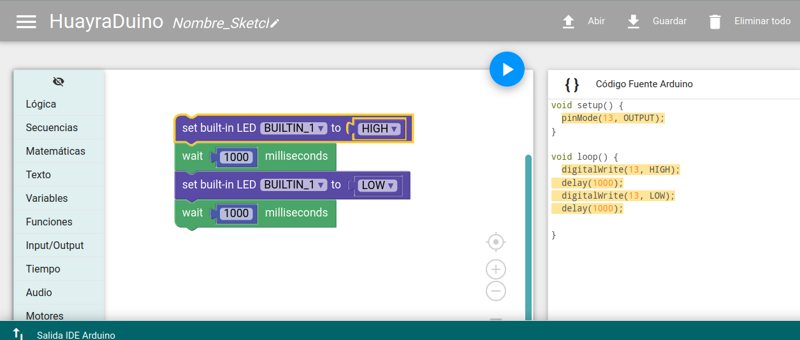

# HuayraDuino LR (La Rioja)

HuayraDuino es un entorno de programación visual para Arduino. Está basado en [Blockly][1], con modificaciones para poder generar código [Arduino][15].

## Características
* Genera código Arduino visualmente arrastrando y soltando bloques.
* Permite subir el programa a una placa Arduino.
* Es compatible con una gran cantidad de placas Arduino originales.



## Clonando el repositorio
Importante: algunos submódulos requieren ser inicializados, por ello la forma correcta de clonar el repo es:

```
git clone https://github.com/HuayraLinux/HuayraDuino-LR.git
cd HuayraDuino-LR
git submodule update --init --recursive
```

## Instalación
La aplicación corre en forma independiente y puede ser ejecutada con:

$ huayra-duino.sh

Necesitás tener instalada la [Arduino IDE version 1.6.x o superior][2].

## Compilación del Servidor
Para construir el servidor que se comunica con Arduino IDE utilizar 
python package/build_pyinstaller.py segun se explica en [Readme build packages][18]

## Créditos
Este proyecto está basado en [BlocklyDuino][16] y Blockly (copyright of Google Inc.) [https://developers.google.com/blockly/][1].
y es un fork de Ardublocky de Carlos Perate https://github.com/carlosperate/

## Licencias

Copyright (c) 2016 carlosperate https://github.com/carlosperate/

Unless stated otherwise, the source code of this projects is
licensed under the Apache License, Version 2.0 (the "License");
you may not use any of the licensed files within this project
except in compliance with the License.

The full document can be found in the [LICENSE][9] file.

Unless required by applicable law or agreed to in writing, software
distributed under the License is distributed on an "AS IS" BASIS,
WITHOUT WARRANTIES OR CONDITIONS OF ANY KIND, either express or implied.
See the License for the specific language governing permissions and
limitations under the License.


[1]: https://developers.google.com/blockly/
[2]: http://www.arduino.cc/en/main/software/
[3]: TODO.md
[4]: https://github.com/carlosperate/ardublockly/releases/
[5]: https://github.com/carlosperate/ardublockly/wiki/Installing-Ardublockly
[6]: https://github.com/carlosperate/ardublockly/wiki/Configure-Ardublockly
[7]: https://github.com/carlosperate/ardublockly/wiki
[8]: https://github.com/carlosperate/ardublockly/compare/blockly-original...master
[9]: https://github.com/HuayraLinux/HuayraDuino-LR/blob/master/LICENSE
[10]: http://ardublockly.embeddedlog.com/demo/index.html
[11]: http://ardublockly.embeddedlog.com/demo/classic/index.html
[12]: http://ardublockly-builds.s3-website-us-west-2.amazonaws.com/index.html?prefix=linux/
[13]: http://ardublockly-builds.s3-website-us-west-2.amazonaws.com/index.html?prefix=windows/
[14]: http://ardublockly-builds.s3-website-us-west-2.amazonaws.com/index.html?prefix=mac/
[15]: http://www.arduino.cc
[16]: https://github.com/BlocklyDuino/BlocklyDuino
[17]: https://github.com/HuayraLinux/HuayraDuino-LR/blob/main/blockly/README.md
[18]: https://github.com/HuayraLinux/HuayraDuino-LR/blob/main/package/README.md